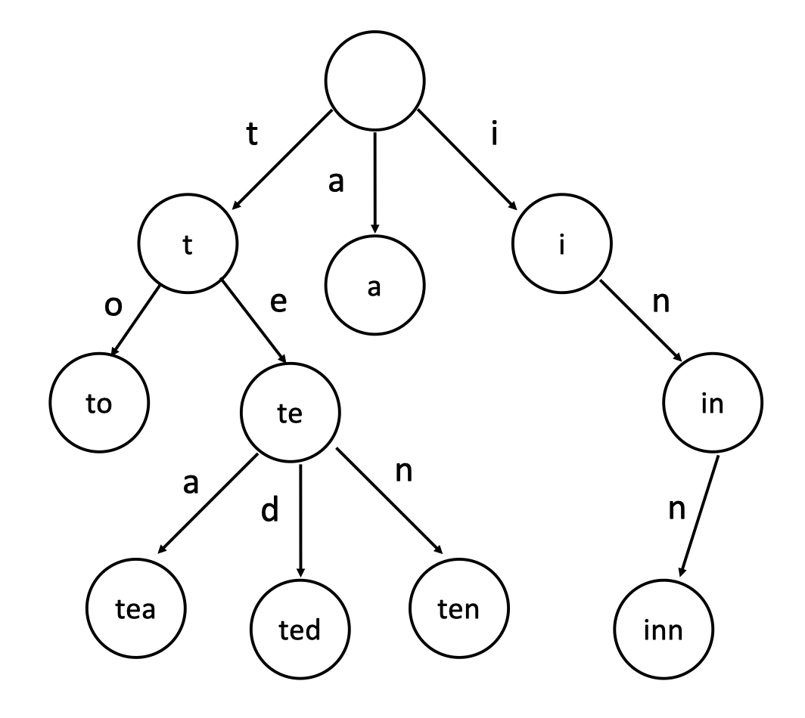
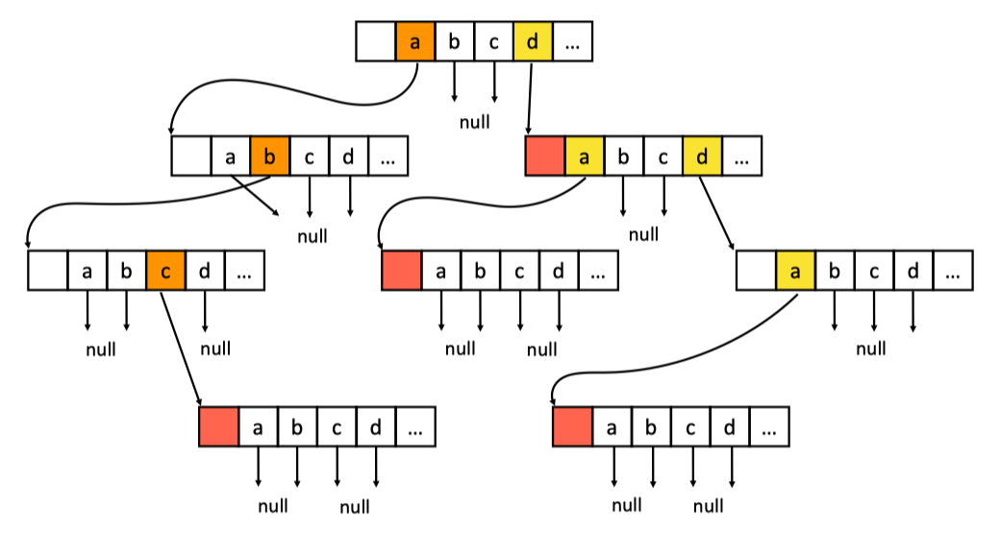

##  字符串处理

### KMP

讲解视频：[最浅显易懂的 KMP 算法讲解](https://www.bilibili.com/video/BV1AY4y157yL?spm_id_from=333.999.0.0&vd_source=b32164f284bb9c8a65190a22f88e3ce5)

```c++
vector<int> strStr(string& str, string& pattern) {
    int m = str.length();
    int n = pattern.length();
    // 构造next数组，next数组是根据模版字符串创建的，默认为-1，即没有前缀能与现在构成的后缀进行匹配
    vector<int> ne(n, -1);
    // 从下标1开始构造，因为下标0一定没有前缀
    // i代表的是后缀，j代表的是前缀
    for (int i = 1, j = -1; i < n; ++i) {
        // 找到第一个pattern[i] == pattern[j + 1]的下标j
        while (j >= 0 && pattern[i] != pattern[j + 1])
            j = ne[j];
        // 如果相同即说明前后缀相匹配
        if (pattern[i] == pattern[j + 1])
            ++j;
        // 得到j
        ne[i] = j;
    }
    // ans存储所有匹配上的首字符下标
    vector<int> ans;
    // i是普通字符串下标，j是模版字符串下标，因为需要回退，j初始化为-1
    for (int i = 0, j = -1; i < m; ++i) {
        while (j >= 0 && str[i] != pattern[j + 1])
            j = ne[j];
        // str[i] == pattern[j + 1]匹配上了，j加1
        if (j + 1 < n && str[i] == pattern[j + 1])
            ++j;
        // j + 1 == n代表匹配完成，首字符下标为i - n + 1
        if (j + 1 == n)
            ans.push_back(i - n + 1);
    }
    return ans;
}
```

### 字典树Trie

> 字典树Trie是一种高效地存储和查找字符串集合的数据结构，由“结点”和“带有字符的边〞构成。
>
> 典型应用是用于统计和排序大量的字符串（但不仅限于字符串），经常被搜索引擎系统用于文本词频统计。
>
> 它的优点是：最大限度地减少无谓的字符串比较，查询效率比哈希表高。



#### 基本性质

1. 结点本身不保存完整单词
2. 从根结点到某一结点，路径上经过的字符连接起来即为该结点对应的单词
3. 每个结点出发的所有边代表的字符都不相同
4. 结点用于存储单词的额外信息（例如频次）

#### 内部实现

1. 字符集数组法（简单）

   每个结点保存一个长度固定为字符集大小（例如26）的数组，以字符为下标，保存指向的结点空间复杂度为`O(结点数*字符集大小)`，查询的时间复杂度为`O(单词长度)`适用于较小字符集，或者单词短、分布稠密的字典

2. 字符集映射法（优化）

   把每个结点上的字符集数组改为一个映射（词频统计：hashmap，排序：ordered map) 空间复杂度为`O(文本字符总数)`，查询的时间复杂度为`O(单词长度)`，但常数稍大一些适用性更广

   

#### 核心思想——空间换时间

* 无论是保存树的结构、字符集数组还是字符集映射，都需要额外的空间

* 利用字符串的公共前缀来降低查询时间的开销以达到提高效率的目的

* 分组思想：前缀相同的字符串在同一子树中

#### 模版

1. 一般实现

   ```C++
   class Trie {
   public:
       Trie() {
           root = new Node();
       }
       
       void insert(string word) {
           Node* cur = root;
           for (char ch : word) {
               if (cur->mp.find(ch) == cur->mp.end()) {
                   cur->mp[ch] = new Node();
               }
               cur = cur->mp[ch];
           }
           ++cur->count;
       }
       
       bool search(string word) {
           Node* cur = root;
           for (char ch : word) {
               if (cur->mp.find(ch) == cur->mp.end()) return false;
               cur = cur->mp[ch];
           }
           return cur->count > 0;
       }
       
       bool startsWith(string prefix) {
           Node* cur = root;
           for (char ch : prefix) {
               if (cur->mp.find(ch) == cur->mp.end()) return false;
               cur = cur->mp[ch];
           }
           return true;
       }
   private:
       struct Node {
           int count;
           unordered_map<char, Node*> mp;
           Node() {
               count = 0;
           }
       };
       Node* root;
   };
   ```


2. 重构实现（更精简）

   ```c++
   struct Trie {
      public: 
     	/** Initialize your data structure here. */
       Trie() {
           root = new Node();
   
       } 
     	/** Inserts a word into the trie. */
       void insert(string word) {
           find(word, true, true);
   
       } 
     	/** Returns if the word is in the trie. */
       bool search(string word) {
           return find(word, true, false);
       }
       /** Returns if there is any word in the trie that starts with the given prefix. */
       bool startsWith(string prefix) {
           return find(prefix, false, false);
       }
   
      private:
       struct Node {
           int count;
           unordered_map<char, Node*> child;
           Node() : count(0) {}
       };
       Node* root;
       bool find(const string& s, bool exact_match, bool insert_if_not_exist) {
           Node* curr = root;
           for (char c : s) {
               if (curr->child.find(c) == curr->child.end()) {
                   if (!insert_if_not_exist)
                       return false;
                   curr->child[c] = new Node();
               }
               curr = curr->child[c];
           }
           if (insert_if_not_exist)
               curr->count++;
           return exact_match ? curr->count > 0 : true;
       }
   };
   ```

### 一道有意思的Trie应用题

#### 最大异或对

>  在给定的N个整数 A1，A2……An中选出两个进行 xor（异或）运算，得到的结果最大是多少？
>
> #### 输入格式
>
> 第一行输入一个整数 N。
>
> 第二行输入N个整数 A1A1～An。
>
> #### 输出格式
>
> 输出一个整数表示答案。
>
> #### 数据范围
>
> 32位整数，N <= 1e5

```c++
#include <iostream>
#include <cstring>
#include <algorithm>
#include <vector>

using namespace std;

struct Node {
    Node* child[2];
    int number;
    Node() {
        number = -1;
        memset(child, 0, sizeof child);
    }
};
Node* root;

void insert(int x) {
    Node* cur = root;
    for (int i = 31; i >= 0; --i) {
        if (x & (1 << i)) {
            if (!cur->child[1]) {
                cur->child[1] = new Node();
            }
            cur = cur->child[1];
        } else {
            if (!cur->child[0]) {
                cur->child[0] = new Node();
            }
            cur = cur->child[0];
        }
    }
    cur->number = x;
}

int cmp(int x) {
    Node* cur = root;
    for (int i = 31; i >= 0; --i) {
        if (x & (1 << i)) {
            cur = cur->child[0] ? cur->child[0] : cur->child[1];
        } else {
            cur = cur->child[1] ? cur->child[1] : cur->child[0];
        }
    }
    return x ^ cur->number;
}

int main() {
    int n;
    cin >> n;
    int nums[n];
    root = new Node();
    for (int i = 0; i < n; ++i) {
        int x;
        cin >> x;
        nums[i] = x;
        insert(x);
    }
    int ans = -1;
    for (int i = 0; i < n; ++i) {
        ans = max(ans, cmp(nums[i]));
    }
    printf("%d\n", ans);
    return 0;
}
```

