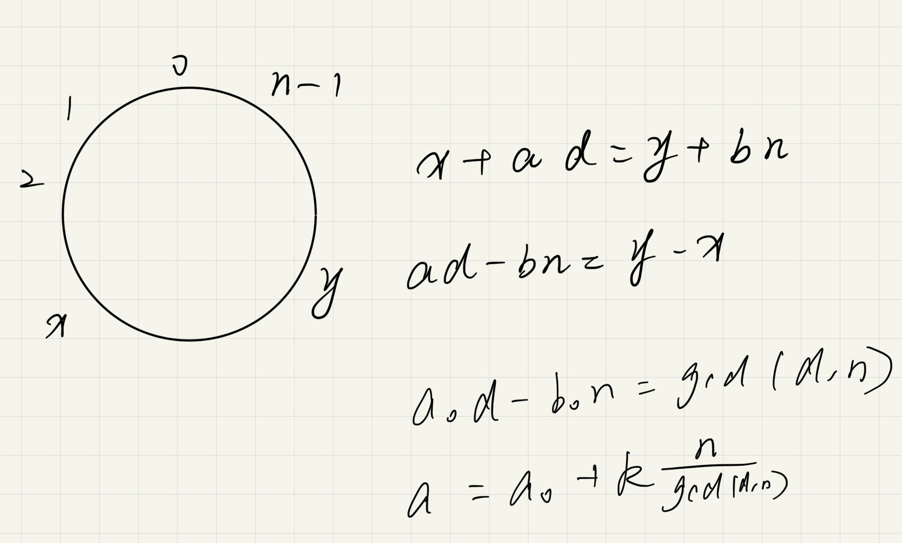

## 数论

### 求最大公约数

公式：$(a, b) = (b, a\  MOD\  b)$

```c++
int gcd (a, b) {
	return b ? gcd(b, a % b) : a;
}
```

### 数论的基础——算术基本定理

公式：$N = P_1^{d_1}\cdot P_2^{d_2}\cdot … \cdot P_n^{d_n}$

其中：$N$是一个正整数，$P_n$是质数，$d_n>0$ 

含义：任何一个正整数可由质数通过一定组合的方式构成

### 筛法求素数——线性筛法

作用：在O(N)的时间复杂度内求出1～n中的所有质数以及每个数的最小质因子

```c++
#include <cstdio>
#include <cstring>
#include <iostream>
#include <string>
#include <algorithm>
#include <vector>
#include <queue>

using namespace std;

const int N = 100010;
int primes[N]; // 存所有质数
bool check[N]; // 判断是否是合数，false表示是质数，true表示是合数
int min_prime[N]; // 存idx之前的最小质因子

int get_prime(int n) {
    int cnt = 0; // 存质数个数
    for (int i = 2; i <= n; ++i) {
        if (!check[i]) min_prime[i] = i, primes[cnt++] = i;
        for (int j = 0; primes[j] * i <= n; ++j) {
            check[primes[j] * i] = true;
            min_prime[primes[j] * i] = primes[j];
            if (i % primes[j] == 0) break; // 保证每一个合数用的是其最小质因子来筛的，这样子算法复杂度是O(n)
        }
    }
    return cnt;
}

int main() {
    int n;
    while (cin >> n) {
        int num = get_prime(n);
        for (int i = 0; i < num; ++i) {
            cout << primes[i] << " ";
        }
        cout << endl;
        printf("继续输入吗，继续按c，退出按q：");
        char ch;
        cin >> ch;
        if (ch == 'q') break;
    }
}
```

### 关于排列组合的数量问题

1. 给定不同的数，求他们的排列组合数量，$number = n!$

   比如：给了3个数，那么它们就可以组成3!种排列组合，[1,2,3]可以组合成[1,2,3]、[1,3,2]、[2,1,3]、[2,3,1]、[3,2,1]、[3,1,2]共六种

2. 对于给定的数有重复的，求他们的排列组合数量，$number = \frac{n!}{a!\cdot b!\cdot ... \cdot x! }$

   即：总的数量的阶乘除以各自数量的阶乘

   比如：1:2个，2：3个，则可以组成(5!) / (2! * 3!)种排列组合方式

### 求一个数的约数个数

也是从算术基本定理出发$N = P_1^{d_1}\cdot P_2^{d_2}\cdot … \cdot P_n^{d_n}$

对于N，我们得到了一串d1，d2……dn，那么对于数字N

约数个数$num = (d_1 + 1) \cdot (d_2 + 1) \cdot ... \cdot (d_n + 1)$

约数之和为$sum = (P_1 + P_1^{1} + ... + P_1^{d_1}) + ... + (P_n + P_n^{1} + ... + P_n^{d_n})$

### 裴蜀定理——拓展欧几里得算法

裴蜀定理：设$a,b$ 是不全为零的整数，则存在整数 , 使得$ax+by=gcd(a,b)$

拓展欧几里得算法： 在求$gcd(a,b)$的过程中求出$x_0,y_0$使得$ax_0+by_0=d$

定义$\left\{ \begin{aligned} a^` & =  a / d \\ b^` & =  b/d \end{aligned} \right. $

得到一组$x_0,y_0$就可以求得所有的解，$\left\{ \begin{aligned} x & =  x_0+kb^` \\ y & =  y_0 - ka^` \end{aligned} \right. $

```c++
#include <cstdio>
#include <cstring>
#include <iostream>

using namespace std;

int exgcd(int a, int b, int& x, int& y) {
    if (!b) {
        x = 1, y = 0;
        return a;
    }
    int d = exgcd(b, a % b, y, x);
    y -= a / b * x;
    return d;
}

int main() {
    while (true) {
        int a, b;
        cin >> a >> b;
        int x, y;
        int d = exgcd(a, b, x, y);
        printf("%d * %d + %d * %d = %d\n", a, x, b, y, d);
        char ch;
        cout << "输入q退出:";
        cin >> ch;
        if (ch == 'q') break;
    }

    return 0;
}
```

#### 模版题

[五指山]([1299. 五指山 - AcWing题库](https://www.acwing.com/problem/content/1301/))

> **题目描述**：大圣在佛祖的手掌中。我们假设佛祖的手掌是一个圆圈，圆圈的长为 n，逆时针记为：0,1,2,…,n−10,1,2,…,n−1，而大圣每次飞的距离为 d，大圣所在的位置记为 x，而大圣想去的地方在 y。要你告诉大圣只能逆时针飞的话至少要飞多少次才能到达目的地。

> **输入格式**：第一行是正整数T表示测试的数据数量，每组测试数据包括一行，四个非负整数，分别为如来手掌圆圈的长度 n，筋斗所能飞的距离 d，大圣的初始位置 x 和大圣想去的地方 y



```c++
#include <cstdio>
#include <iostream>

using namespace std;

typedef long long LL;

LL exgcd(LL a, LL b, LL& x, LL& y) {
    // ax + by = gcd(a, b)
    if (!b) {
        x = 1, y = 0;
        return a;
    }
    int d = exgcd(b, a % b, y, x);
    y -= a / b * x;
    return d;
}


int main() {
    int T;
    cin >> T;
    while (T--) {
        LL n, d, x, y, a, b;
        cin >> n >> d >> x >> y;
        int gcd = exgcd(d, n, a, b);
        if ((y - x) % gcd != 0) printf("Impossible\n");
        else {
          	// 现在的ad + bn = gcd(d,n)，要使得等式右边为y - x，则两边要都乘上(y - x) / gcd
            a *= (y - x) / gcd; 
            n /= gcd; // 按照式子来做
            printf("%lld\n", (a % n + n) % n); // 防止输出负约数
        }
    }
    
    return 0;
}
```

