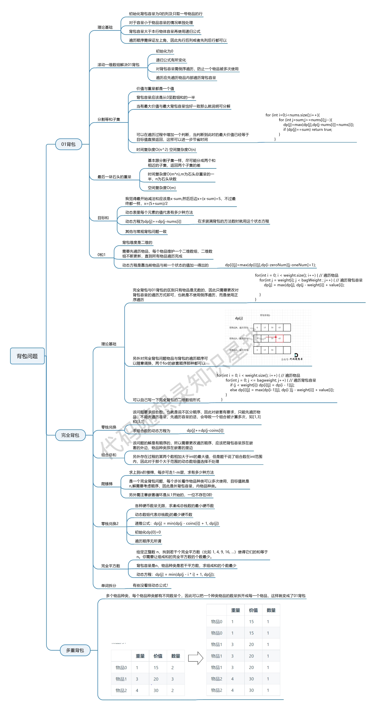

## 动归做题顺序

1. 确定dp数组以及下标的意义
2. 确定递推公式
3. dp数组如何初始化
4. 确定遍历顺序
5. 举例推导dp数组

## 背包递推公式

1. 问能否装满背包（或者最多装多少）：`dp[j] = max(dp[j], dp[j - nums[j]] + nums[i]);`
2. 问装满背包有几种方法：`dp[j] += dp[j - nums[i]]`
3. 问背包装满最大价值：`dp[j] = max(dp[j], dp[j - weight[i]] + value[i]);`
4. 问装满背包所有物品的最小个数：`dp[j] = min(dp[j - coins[i]] + 1, dp[j]);`

## 遍历顺序

一、对于01背包，一位数组的遍历方式是先物品再背包，同时对于背包的遍历是倒序的

二、在求装满背包（完全背包）有几种方案的时候，认清遍历顺序是非常关键的。

> **如果求组合数就是外层for循环遍历物品，内层for遍历背包**。

对于组合来说，[1,2,3]与[2,1,3]是一种东西，因此先for物品可以保证物品的使用顺序是固定的

> **如果求排列数就是外层for遍历背包，内层for循环遍历物品**。

对于排列数来说，[1,2,3]与[3,1,2]就不是一种东西，因此需要先for背包，来让物品的使用顺序是变化的